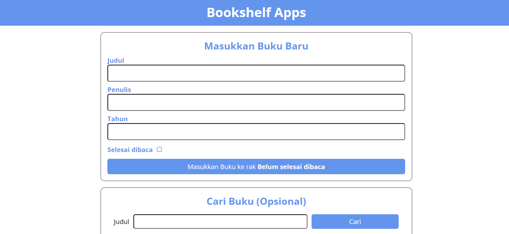

# Bookshelf
> Website used to store book records using local storage.
> Live demo [_here_](https://shelfbooks.netlify.app/).

## Table of Contents
* [General Info](#general-information)
* [Technologies Used](#technologies-used)
* [Features](#features)
* [Screenshots](#screenshots)
* [Setup](#setup)
* [Project Status](#project-status)
* [Acknowledgements](#acknowledgements)
* [Contact](#contact)

## General Information
- Manage books.
- This website is used to record any books.

## Technologies Used
- HTML5
- Javascript ES6.

## Features
- :heavy_plus_sign: Add books by filling in the **title**, **writter** and **years**.
- :no_entry: Delete books in **read** and **unread** sections.
- :bookmark_tabs: Display a **list** of read books.
- :books: Move books to **read or unread** section.

## Screenshots

## Setup
To run this project, running it locally using live-server or open the index.html file

## Project Status
Project is: _complete._ <!-- / _complete_ / _no longer being worked on_. reason ? -->

## Acknowledgements
- This project was based on [this course](https://www.dicoding.com/)
- Many thanks to **Dicoding Indonesia**

## Contact
Created by [@Zulhaditya](https://itsmyportofolio.netlify.app/) - feel free to contact me!
